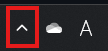

# CapLoupe

  

「CapLoupe」はショートカットキーでスクリーンの任意の範囲を選択し、拡大・移動しながら詳細を確認できるWindows用拡大鏡ツールです。

  

## インストール方法

1. [ここ](https://github.com/MRyutaro/CapLoupe/releases)から最新のインストーラをダウンロードする。
2. 管理者権限でインストーラを起動する。
2. インストーラの手順通りにインストールする。

## 使い方

1. `Shift+Alt+Z`を押した後、マウスで領域選択をする。
2. ホイールで拡大・縮小したり、左クリック+マウス移動で移動をしたりすることで画像を確認する。

## アンインストール方法

1. 以下の画像の赤い枠の部分を選択した後CapLoupeのアイコンを右クリックし終了ボタンを押す。

2. `C:\Program Files (x86)\CapLoupe\unins000.exe`を実行する。

## For Developers

開発を手伝ってくださる方は、このレポジトリをフォークし編集を行った後プルリクエストを送ってください。

## お問い合わせ

追加してほしい機能やバグの修正依頼などがあればこのレポジトリのIssuesに書き込むか、`m2002r1028@icloud.com`までお問い合わせください。
